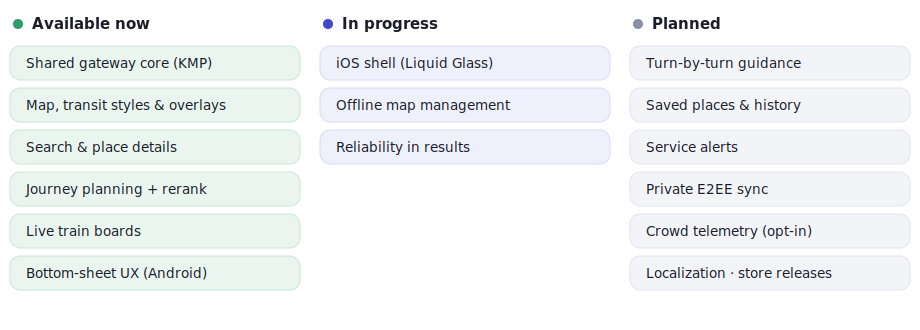

# Roadmap

Where the Iter Maps app is, and where it's going.

<picture>
  <source media="(prefers-color-scheme: dark)" srcset="docs/assets/roadmap-dark.svg">
  
</picture>

**Available now** — shared gateway core (search, routing, places, boards, reliability, offline) · Android app: map & transit styles, bottom-sheet UX, search & place details, journey planning, live train boards, settings.

**In progress** — iOS app (Liquid Glass shell) · offline map management · reliability surfaces in results.

**Planned** — turn-by-turn guidance · saved places & history · service alerts · private E2EE sync · opt-in crowd telemetry · localization beyond Italian · store releases.

> The engineering worklist behind each item lives in [`docs/roadmap/`](docs/roadmap/).
